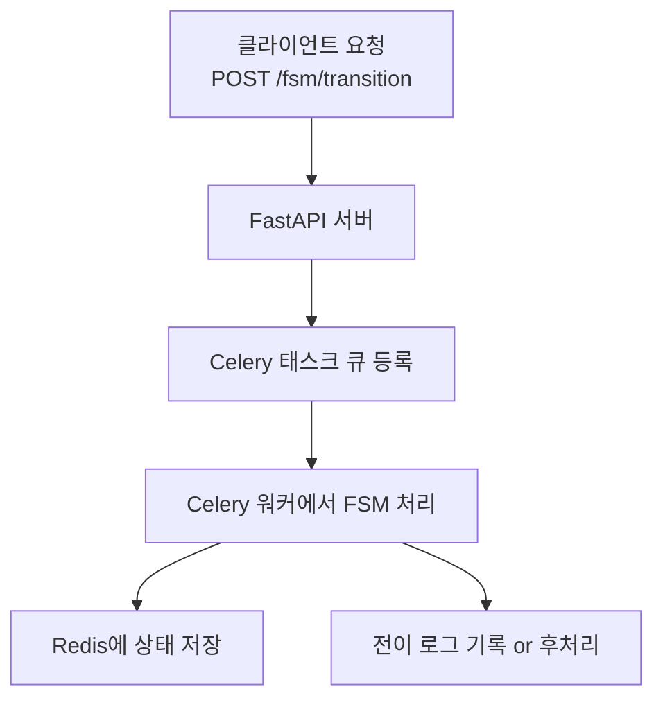

# FSM 처리 서버 시스템(FastAPI + Redis + Celery + Flower)

해보는거지~

## Step 1: Redis + Celery + Flower 실행

docker-compose up --build

## Step 2: FastAPI는 따로 로컬에서 실행

## 서버 정보

uvicorn main:app --reload

Redis 서버: localhost:6379

Celery 워커: celery-fsm

Flower 대시보드: http://localhost:5555
